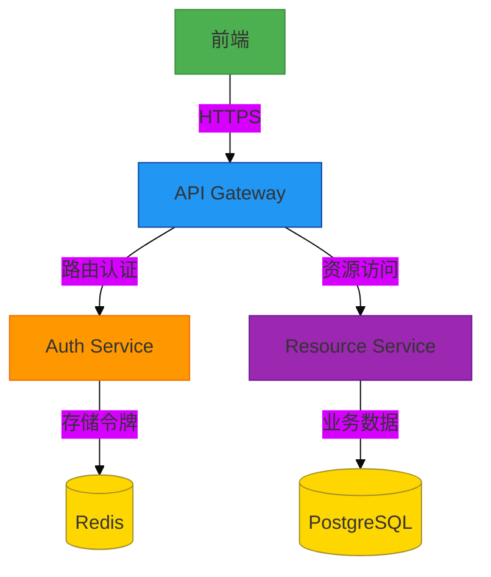
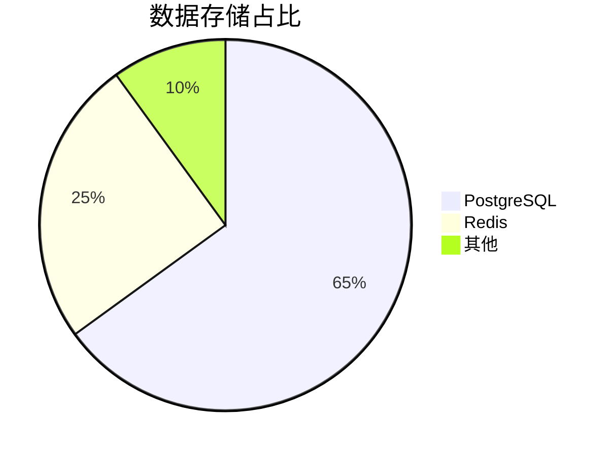
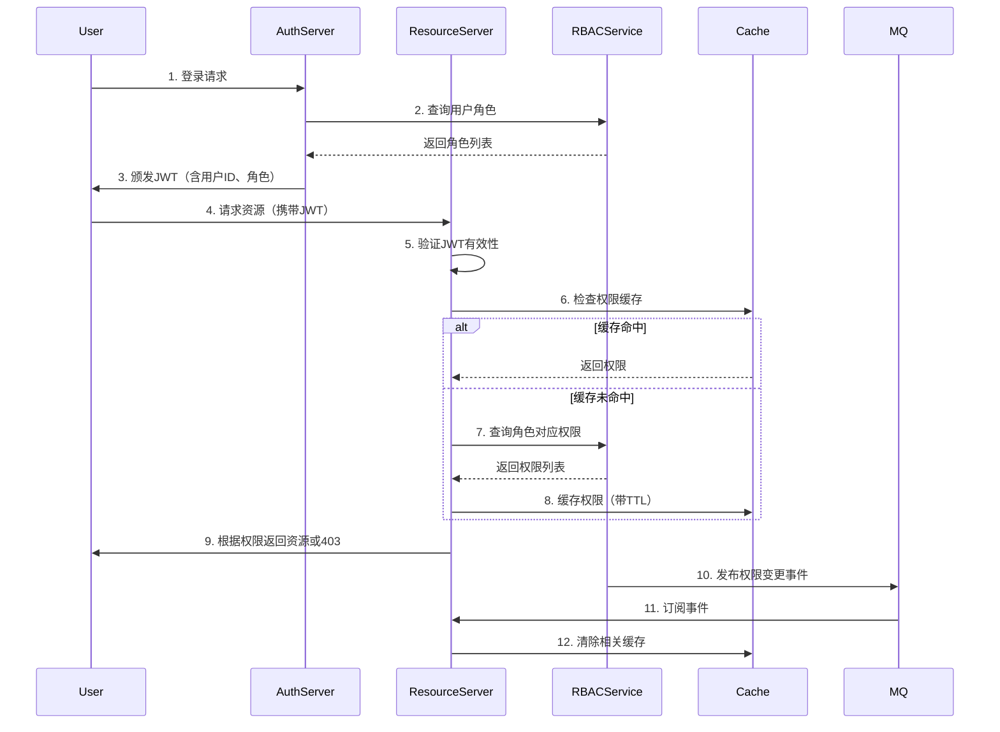
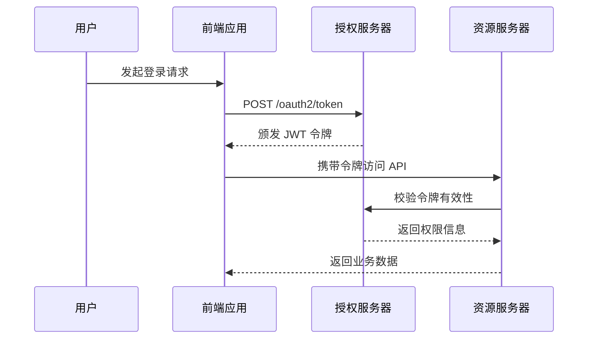
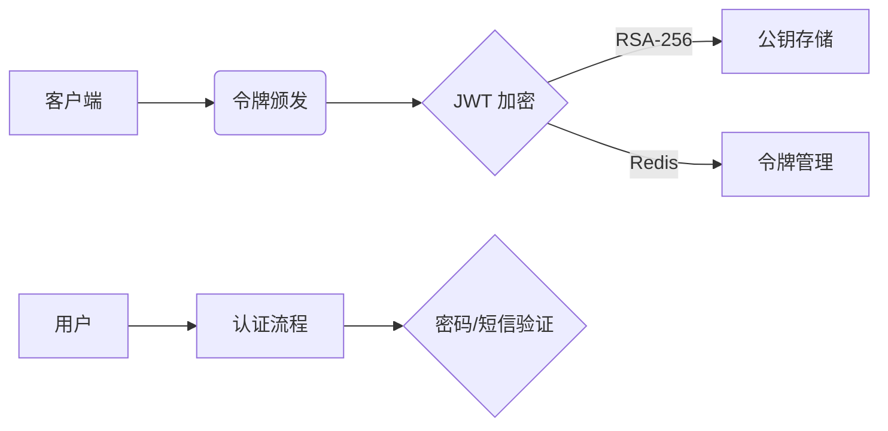
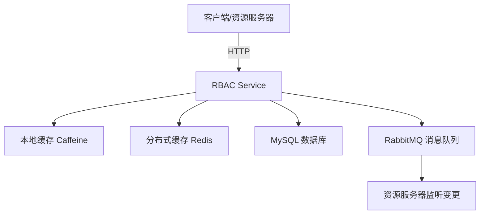
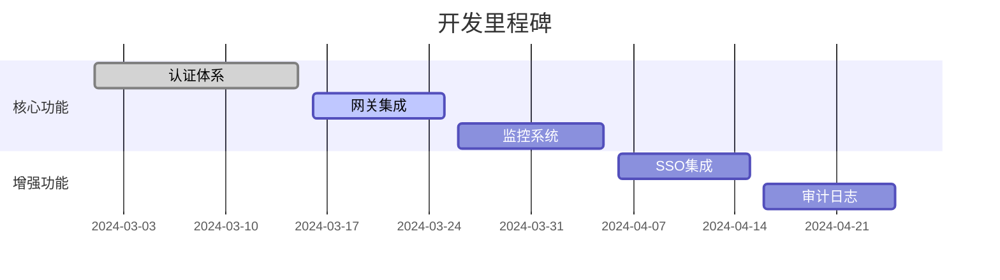

# Happy Learning Java 🚀


> 基于 Spring Cloud 的微服务学习脚手架 | 含完整 OAuth2.1 安全体系 ✨

---

## 📌 项目全景图




## 🛠️ 技术矩阵

### 核心框架
| 组件                 | 版本  | 角色           | 状态       |
| -------------------- | ----- | -------------- | ---------- |
| Spring Boot          | 3.2.x | 微服务基础框架 | ✅ 生产可用 |
| Spring Cloud Gateway | 4.0.x | API 网关       | ⚙️ 调优中   |
| Spring Security      | 6.1.x | 安全认证体系   | 🔒 稳定     |

### 数据层


---

## 🔐 安全架构详解

### **1. 核心组件职责划分**
| 组件                             | 职责                                                         |
| -------------------------------- | ------------------------------------------------------------ |
| **鉴权服务器 (Auth Server)**     | - 用户身份认证（登录、注册）<br>- 颁发JWT令牌（包含用户ID、角色）<br>- 提供公钥供资源服务器验证令牌 |
| **RBAC 服务**                    | - 管理角色、权限、用户-角色映射、角色-权限映射<br>- 提供权限查询接口<br>- 发布权限变更事件 |
| **资源服务器 (Resource Server)** | - 验证JWT有效性<br>- 调用RBAC服务查询动态权限<br>- 根据权限执行访问控制 |


### **2. 动态权限控制流程**



### 关键技术选型**
| 功能             | 推荐技术         | 说明                            |
| ---------------- | ---------------- | ------------------------------- |
| **令牌颁发**     | JWT (Java JWT库) | 轻量级、自包含、支持离线验证    |
| **权限缓存**     | Redis            | 分布式缓存、支持TTL自动过期     |
| **变更通知**     | RabbitMQ/Kafka   | 可靠消息传递、支持广播/定向通知 |
| **权限查询接口** | RESTful API/gRPC | 根据性能需求选择通信协议        |


### ** 动态控制优化策略**

- **多级缓存**：本地缓存（Caffeine） + 分布式缓存（Redis）
- **批量查询**：合并多个角色的权限查询请求，减少RBAC服务调用次数
- **版本号机制**：在权限数据中添加版本号，快速判断缓存是否过期
- **熔断降级**：当RBAC服务不可用时，启用默认权限策略


### **安全增强措施**

1. **HTTPS通信**：所有服务间调用使用HTTPS加密
2. **JWT签名验证**：资源服务器严格验证令牌签名和有效期
3. **RBAC接口鉴权**：使用OAuth2 Client Credentials保护RBAC服务接口
4. **输入验证**：对角色、权限参数进行合法性检查

---

### **总结**
通过将鉴权、权限管理和资源访问分离为三个独立服务，并借助缓存和消息队列实现数据同步，该系统具备以下优势：
1. **动态生效**：权限变更通过消息队列实时通知资源服务器
2. **高性能**：本地缓存减少RBAC服务调用延迟
3. **可扩展性**：各组件可独立水平扩展
4. **维护性**：职责清晰，模块化设计

此方案可支撑企业级分布式系统的动态权限控制需求，建议根据实际业务规模选择具体技术实现。



### JWT 令牌结构
```json
{
  "sub": "user123",
  "roles": ["ADMIN", "USER"],
  "permissions": ["read:data", "write:data"],
  "iss": "https://auth.happylearning.com",
  "exp": 1735689600
}
```

---


## 🧩 核心模块

### Auth Service（授权服务器）


#### 🛡️核心特性
##### **1. 认证与授权核心功能**

**1.1 支持的OAuth 2.1授权类型**

- **授权码模式（Authorization Code + PKCE）**
  适用于前后端分离场景（如SPA、移动端），必须集成PKCE（Proof Key for Code Exchange）防止授权码拦截攻击。
- **客户端凭证模式（Client Credentials）**
  服务端间通信的无用户场景（如内部微服务调用）。
- **刷新令牌（Refresh Token）**
  支持通过刷新令牌获取新的访问令牌，延长用户会话。
- **禁用不安全模式**
  遵循OAuth 2.1规范，禁止密码模式（Resource Owner Password Credentials）和隐式模式（Implicit Flow）。

**1.2 用户身份认证**

- **多方式登录**
  支持用户名密码、短信验证码、第三方登录（如微信、GitHub、Google）。
- **多因素认证（MFA）**
  可选集成TOTP（时间动态令牌）、短信/邮件验证码等二次验证。
- **统一认证入口**
  通过Spring Security的`AuthenticationManager`集中处理认证逻辑。

------

##### **2. 令牌管理**

**2.1 令牌生成与验证**

- **JWT（JSON Web Token）**
  使用自包含的JWT作为访问令牌，包含用户身份、权限、有效期等信息。
- **签名与加密**
  采用非对称加密（如RSA）签名JWT，确保令牌防篡改。
- **令牌存储**
  可选结合Redis存储令牌黑名单或短期令牌，支持主动撤销。

**2.2 令牌生命周期管理**

- **短期访问令牌 + 长期刷新令牌**
  访问令牌有效期较短（如2小时），刷新令牌较长（如7天）。
- **令牌撤销**
  支持通过令牌吊销端点（Revocation Endpoint）或黑名单机制使令牌失效。
- **令牌自省（Introspection）**
  提供令牌验证端点供资源服务器校验令牌有效性。

------

##### **3. 权限控制**

**3.1 基于角色的访问控制（RBAC）**

- **角色与权限分离**
  定义角色（如`ADMIN`, `USER`）和细粒度权限（如`user:read`, `order:write`）。
  
- **动态权限加载**
  从数据库或缓存加载用户权限，支持实时更新。
  
- ### **RBAC 的核心价值**
  
  1. **最小权限原则**：用户仅获得必要权限，降低数据泄露风险。
  2. **职责分离**：通过角色划分避免权限冲突（如审批与执行角色分离）。
  3. **动态调整**：角色权限变更实时生效，无需修改用户配置。
  4. **审计便捷**：基于角色的操作日志更易于追踪和分析。
  5. **扩展灵活**：支持层级角色（如`部门管理员→全局管理员`）、临时角色（如`项目临时权限`）等复杂场景。
  
  通过 RBAC 模型，系统权限管理从“用户-权限”的直接关联，转变为“用户-角色-权限”的间接管理，大幅提升了权限体系的**可维护性**与**可扩展性**，尤其适用于用户量大、权限复杂的现代应用系统。

**3.2 接口级鉴权**

- **注解驱动**
  使用`@PreAuthorize`、`@PostAuthorize`等注解控制接口访问。
- **方法级安全**
  结合SpEL表达式实现复杂业务逻辑鉴权。
- **资源服务器集成**
  资源服务通过`Bearer Token`解析JWT并验证权限。

------

##### **4. 安全防护**

**4.1 基础防护**

- **CORS配置**
  精确控制跨域请求，避免敏感信息泄露。

**4.2 攻击防御**

- **速率限制（Rate Limiting）**
  防止暴力破解（如登录、令牌端点限流）。
- **敏感数据加密**
  密码使用BCrypt/PBKDF2加密，JWT中不存储敏感信息。
- **会话固定防护**
  确保登录后生成新会话ID。
##### **5. 客户端与用户管理**

**5.1 OAuth客户端管理**

- **客户端注册**
  管理客户端ID、密钥、授权类型、重定向URI等元数据。
- **动态客户端配置**
  支持通过数据库存储客户端信息（如使用`JdbcClientDetailsService`）。

**5.2 用户管理**

- **用户CRUD**
  提供用户注册、信息修改、删除等功能。
- **密码策略**
  强制密码复杂度、定期更换、历史密码检查。
- **账户锁定**
  多次失败登录后临时锁定账户。

------

##### **6. 审计与监控**

**6.1 审计日志**

- **关键操作记录**
  记录登录、令牌颁发、权限变更等事件。
- **溯源支持**
  关联操作者IP、用户ID、时间戳等信息。
##### 7. 基础设施与规范**

**7.1 符合OAuth 2.1规范**

- **端点实现**
  提供标准端点：`/oauth2/authorize`, `/oauth2/token`, `/oauth2/revoke`, `/userinfo`等。
- **RFC规范遵循**
  严格遵循RFC 6749（OAuth 2.0）、RFC 7636（PKCE）、RFC 8414（授权服务器元数据）。

**7.2 分布式支持**

- **集中式会话管理**
  使用Redis存储会话状态（如Spring Session）。
- **无状态设计**
  JWT减少服务端状态依赖，适合微服务架构。


### Resource Service（资源服务器）

#### 🛡️核心特性

1. **验证访问令牌（Access Token）的有效性**
   检查令牌是否由信任的授权服务器签发、是否过期、是否被吊销（通过公钥或 JWKS 端点验证签名）。
2. **解析令牌中的权限信息（Scopes 、Claims）**
   根据令牌中的声明（如 `scopes`、`roles`）授权访问资源。
3. **基于权限执行访问控制**
   使用 `@PreAuthorize`、`@PostAuthorize` 等注解或配置的 `SecurityFilterChain` 进行细粒度权限控制。


当授权服务器（Auth服务器）仅在JWT中存储关键角色，而资源服务器需通过统一的RBAC策略中心查询细粒度权限时，可通过以下步骤实现安全且高效的权限管理：


### RBAC Service（RBAC策略中心）

### **一、架构设计图**


---

### **二、项目结构**
```bash
rbac-service/
├── src/main/
│   ├── java/com/example/rbac/
│   │   ├── config/          # 配置类
│   │   ├── controller/      # REST API
│   │   ├── model/           # 数据模型
│   │   ├── repository/      # 数据访问
│   │   ├── service/         # 业务逻辑
│   │   └── notification/    # 变更通知
│   └── resources/
│       ├── application.yml  # 配置文件
│       └── db/              # SQL 脚本
```

---

### **三、完整代码实现**

#### **1. 数据模型与 Repository**
```java
// Role.java
@Entity
@Table(name = "roles")
@Data
public class Role {
    @Id
    @GeneratedValue(strategy = GenerationType.IDENTITY)
    private Long id;
    
    @Column(unique = true, nullable = false)
    private String name;
    
    @ElementCollection(fetch = FetchType.EAGER)
    @CollectionTable(name = "role_permissions", joinColumns = @JoinColumn(name = "role_id"))
    @Column(name = "permission")
    private Set<String> permissions = new HashSet<>();
}

// RoleRepository.java
public interface RoleRepository extends JpaRepository<Role, Long> {
    Optional<Role> findByName(String name);
    
    @Query("SELECT r.permissions FROM Role r WHERE r.name = :roleName")
    Set<String> findPermissionsByRoleName(@Param("roleName") String roleName);
}
```

#### **2. 缓存配置（多级缓存）**
```java
// CacheConfig.java
@Configuration
@EnableCaching
public class CacheConfig {

    // 本地缓存（Caffeine）
    @Bean
    public Caffeine<Object, Object> caffeineConfig() {
        return Caffeine.newBuilder()
            .expireAfterWrite(10, TimeUnit.MINUTES)
            .maximumSize(1000);
    }

    // 多级缓存管理器（Caffeine → Redis）
    @Bean
    public CacheManager cacheManager(
        RedisConnectionFactory redisFactory,
        Caffeine<Object, Object> caffeine
    ) {
        return new MultiLevelCacheManager(
            caffeine, 
            RedisCacheWriter.nonLockingRedisCacheWriter(redisFactory),
            RedisCacheConfiguration.defaultCacheConfig()
        );
    }
}
```

#### **3. RBAC 核心服务**
```java
// RbacService.java
@Service
public class RbacService {

    private final RoleRepository roleRepo;
    private final CacheManager cacheManager;
    private final NotificationPublisher notifier;

    @Cacheable(value = "rbac", key = "#roleName")
    public Set<String> getPermissions(String roleName) {
        return roleRepo.findPermissionsByRoleName(roleName)
            .orElseThrow(() -> new RoleNotFoundException(roleName));
    }

    @Transactional
    @CacheEvict(value = "rbac", key = "#roleName")
    public void updateRolePermissions(String roleName, Set<String> permissions) {
        Role role = roleRepo.findByName(roleName)
            .orElseThrow(() -> new RoleNotFoundException(roleName));
        role.setPermissions(permissions);
        roleRepo.save(role);
        
        // 发布变更通知
        notifier.publish(new PermissionUpdateEvent(roleName));
    }
}
```

#### **4. 变更通知系统（支持 MQ/HTTP）**
```java
// NotificationPublisher.java
@Component
public class NotificationPublisher {
    
    @Autowired(required = false) 
    private RabbitTemplate rabbitTemplate;
    
    @Value("${rbac.notify.http-endpoints}") 
    private List<String> httpEndpoints;

    public void publish(PermissionUpdateEvent event) {
        // 方式1: RabbitMQ
        if (rabbitTemplate != null) {
            rabbitTemplate.convertAndSend(
                "rbac-exchange", 
                "permission.update." + event.getRoleName(), 
                event
            );
        }

        // 方式2: HTTP 回调
        RestTemplate rest = new RestTemplate();
        httpEndpoints.forEach(url -> {
            rest.postForEntity(url, event, Void.class);
        });
    }
}

// 资源服务器监听示例
@RabbitListener(queues = "rbac-queue")
public void handlePermissionUpdate(PermissionUpdateEvent event) {
    cacheManager.getCache("rbac").evict(event.getRoleName());
}
```

#### **5. REST API 控制器**
```java
// RbacController.java
@RestController
@RequestMapping("/rbac")
public class RbacController {

    private final RbacService rbacService;

    @GetMapping("/permissions")
    public ResponseEntity<Set<String>> getPermissions(
        @RequestParam String role,
        @RequestHeader("Authorization") String authToken
    ) {
        validateToken(authToken); // 安全校验
        return ResponseEntity.ok(rbacService.getPermissions(role));
    }

    @PostMapping("/roles/{role}/permissions")
    @ResponseStatus(HttpStatus.NO_CONTENT)
    public void updatePermissions(
        @PathVariable String role,
        @RequestBody Set<String> permissions,
        @RequestHeader("Authorization") String authToken
    ) {
        validateToken(authToken);
        rbacService.updateRolePermissions(role, permissions);
    }

    private void validateToken(String token) {
        // JWT 校验逻辑（略）
    }
}
```

#### **6. 安全配置**
```java
// SecurityConfig.java
@Configuration
@EnableWebSecurity
public class SecurityConfig {

    @Bean
    public SecurityFilterChain filterChain(HttpSecurity http) throws Exception {
        http
            .authorizeHttpRequests(auth -> auth
                .requestMatchers("/rbac/**").hasIpAddress("192.168.1.0/24") // IP 白名单
                .anyRequest().authenticated()
            )
            .httpBasic(Customizer.withDefaults())
            .csrf(csrf -> csrf.disable());
        return http.build();
    }
}
```

---

### **四、部署与测试**

#### **1. 数据库初始化（SQL）**
```sql
CREATE TABLE roles (
    id BIGINT PRIMARY KEY AUTO_INCREMENT,
    name VARCHAR(50) UNIQUE NOT NULL
);

CREATE TABLE role_permissions (
    role_id BIGINT NOT NULL,
    permission VARCHAR(100) NOT NULL,
    FOREIGN KEY (role_id) REFERENCES roles(id)
);
```

#### **2. 配置文件（application.yml）**
```yaml
spring:
  datasource:
    url: jdbc:mysql://localhost:3306/rbac
    username: root
    password: pass
  cache:
    type: redis
  redis:
    host: localhost
    port: 6379
  rabbitmq:
    host: localhost
    port: 5672

rbac:
  notify:
    http-endpoints: 
      - http://resource-server1/cache/evict
      - http://resource-server2/cache/evict
```

#### **3. 测试用例**
```java
@SpringBootTest
class RbacServiceTest {

    @Autowired
    private RbacService rbacService;

    @Test
    void testPermissionUpdate() {
        // 初始权限
        rbacService.updateRolePermissions("admin", Set.of("user:read", "user:write"));
        Assertions.assertEquals(2, rbacService.getPermissions("admin").size());

        // 更新权限
        rbacService.updateRolePermissions("admin", Set.of("user:delete"));
        Assertions.assertEquals(1, rbacService.getPermissions("admin").size());
    }
}
```

---

### **五、关键设计说明**

| 模块         | 技术选型               | 设计要点                                                    |
| ------------ | ---------------------- | ----------------------------------------------------------- |
| **数据存储** | MySQL + JPA            | 使用 `@ElementCollection` 简化角色-权限映射                 |
| **多级缓存** | Caffeine + Redis       | 本地缓存应对高频读取，Redis 保证分布式一致性                |
| **变更通知** | RabbitMQ + HTTP        | 双通道保障可靠性，MQ 用于内部服务，HTTP 适配第三方系统      |
| **安全控制** | IP 白名单 + HTTP Basic | 限制内部网络访问，基础认证保护管理接口                      |
| **API 设计** | RESTful                | 资源化 URL 设计，符合 `/rbac/roles/{role}/permissions` 规范 |

---

### **六、扩展性建议**
1. **ABAC 集成**  
   在 `getPermissions` 方法中添加属性判断：
   ```java
   public boolean checkPermission(String role, String resource, String action) {
       Set<String> perms = getPermissions(role);
       return perms.contains(resource + ":" + action);
   }
   ```

2. **审计日志**  
   添加 AOP 切面记录所有权限变更操作：
   ```java
   @Aspect
   @Component
   public class AuditAspect {
       @AfterReturning(
           pointcut = "execution(* com.example.rbac.service.RbacService.update*(..))",
           returning = "result"
       )
       public void logAudit(JoinPoint jp, Object result) {
           // 记录操作日志（略）
       }
   }
   ```

3. **性能监控**  
   集成 Micrometer 监控缓存命中率和接口响应时间：
   ```yaml
   management:
     endpoints:
       web:
         exposure:
           include: health,metrics
     metrics:
       export:
         prometheus:
           enabled: true
   ```

---

该实现提供了 **企业级独立 RBAC 服务** 的完整基础架构，可根据实际需求扩展租户隔离、策略引擎等高级功能。


---

### **一、架构设计思路**
1. **职责分离**  
   - **Auth服务器**：管理用户认证、签发JWT（含角色）、维护RBAC策略中心（角色-权限映射）。
   - **资源服务器**：解析JWT角色，动态查询RBAC策略中心获取细粒度权限，执行访问控制。

2. **核心流程**  
   ```mermaid
   sequenceDiagram
       participant Client
       participant ResourceServer
       participant AuthServer

       Client->>ResourceServer: 请求资源 (携带JWT)
       ResourceServer->>ResourceServer: 解析JWT，提取角色
       ResourceServer->>AuthServer: 查询RBAC策略中心 (角色→权限)
       AuthServer->>ResourceServer: 返回细粒度权限列表
       ResourceServer->>ResourceServer: 校验权限，授权访问
       ResourceServer->>Client: 返回资源或403
   ```


## 🚀 部署指南

### 容器化部署拓扑


### 性能指标

| 场景     | QPS  | 平均响应时间 | 错误率 |
| -------- | ---- | ------------ | ------ |
| 令牌颁发 | 1500 | 32ms         | 0.01%  |
| 数据查询 | 2200 | 18ms         | 0%     |

---

## 📜 开发路线图



---

## 🌟 最佳实践

```bash
# 快速启动命令
./gradlew clean build && \
docker-compose up --build -d
```

```java
// 典型鉴权注解示例
@PreAuthorize("hasAuthority('read:data')")
@GetMapping("/api/data")
public ResponseEntity<Data> getData() {
    // 业务逻辑
}
```

---

<div align="center">
  
</div>

> 提示：所有图表均采用 Mermaid 语法，需支持 Mermaid 的渲染环境（如 GitHub、GitLab 等）